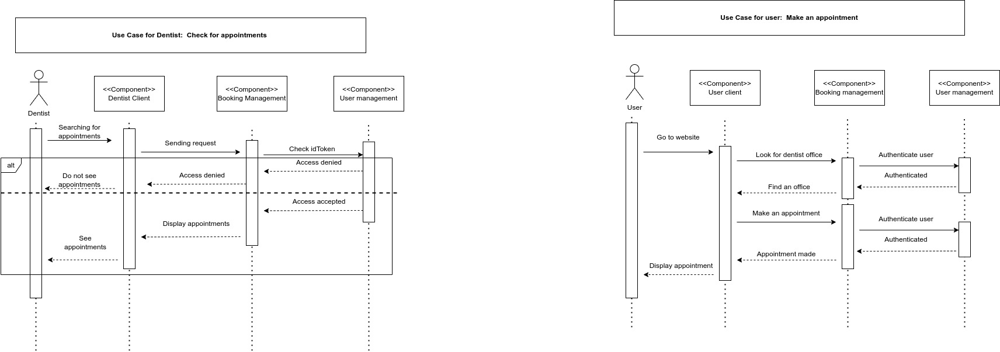

# Booking Management

# Name
Booking Management component 

This component has the Pipe-filter architectural style. It acts as a filter for booking appointments and fetching offices using filtering features. It is also handling all interactions with the database for the appointments, and registration of the dentist breaks. 

The component also has a circuit breaker implementation to handle cases where a big amount of messages are being registered. The circuit breaker will handle the incoming messages until a certain threshold is met. When this threshold is met, the circuit breaker will open, preventing the messages from being handled by the component. When messages stop coming in the circuit breaker will enter a 'halfOpen' state. In this state, it is listening for new incoming messages. If the incoming messages stay below the threshold, the circuit will go back to its original state which is the closed state and messages can once again flow freely. 

## Visuals

Diagrams

## Installation

To run this component you need to do the following steps:

- Clone the repository on your device.
- Open a terminal and navigate to the folder "booking-management".
- Right-click anywhere in the folder and open up the terminal.
- In the terminal type "npm install", which installs all necessary dependencies.
- Once that installation is complete type "npm start" in the terminal.

## Usage

The application is now running and you can use it to send and receive messages to the database by using the frontend components of this project, or if you just wanna simulate messages, use software like MQTTX. 

## Authors and acknowledgment

Authors: \
Albin Karlsson \
Erik Lindmaa

## License

MIT License

Copyright (c) 2023 courses / DIT355 / DIT356  2022 / T-6

Permission is hereby granted, free of charge, to any person obtaining a copy
of this software and associated documentation files (the "Software"), to deal
in the Software without restriction, including without limitation the rights
to use, copy, modify, merge, publish, distribute, sublicense, and/or sell
copies of the Software, and to permit persons to whom the Software is
furnished to do so, subject to the following conditions:

The above copyright notice and this permission notice shall be included in all
copies or substantial portions of the Software.

THE SOFTWARE IS PROVIDED "AS IS", WITHOUT WARRANTY OF ANY KIND, EXPRESS OR
IMPLIED, INCLUDING BUT NOT LIMITED TO THE WARRANTIES OF MERCHANTABILITY,
FITNESS FOR A PARTICULAR PURPOSE AND NONINFRINGEMENT. IN NO EVENT SHALL THE
AUTHORS OR COPYRIGHT HOLDERS BE LIABLE FOR ANY CLAIM, DAMAGES OR OTHER
LIABILITY, WHETHER IN AN ACTION OF CONTRACT, TORT OR OTHERWISE, ARISING FROM,
OUT OF OR IN CONNECTION WITH THE SOFTWARE OR THE USE OR OTHER DEALINGS IN THE
SOFTWARE.

