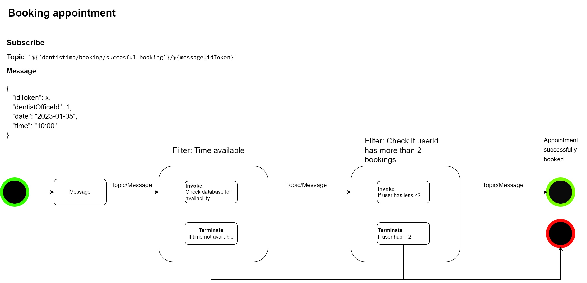

# Booking Management

# Name
Booking Management component 

This component has the Pipe-filter architectural style. It acts as a filter for booking appointments, fetching offices using filtering features,
it allows dentists to also book their lunch breaks and 'fika' breaks. 

## Visuals

Diagram

## Installation

To run this component you need to do follow the following steps:

- Clone the repository on your device
- Open a terminal and navigate to the folder "booking-management"
- Right click anywhere in the folder and open up a terminal
- In the terminal type "npm install", which installs all necessary dependencies
- Once that installation is complete type "npm start" in the terminal.

The application is now running and you cen use it to send and receive messages to the database by using, for example, MQTTX.

## Usage

Usage, use subheadings if needed

## Authors and acknowledgment

Authors
Albin Karlsson
Erik Lindmaa

## License

What lisense should we  use?

